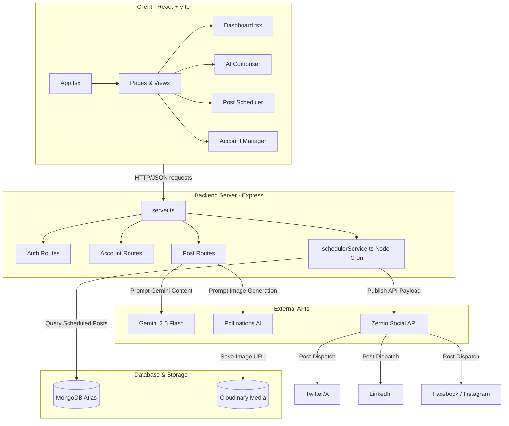

# 🚀 AI-Powered Social Media Automation Suite

A modern, full-stack application designed to orchestrate social media campaigns seamlessly. Users can connect their social channels via **Zernio**, compose content with advanced AI (using Google Gemini 2.5 Flash and Pollinations AI for image generation), schedule posts, and view comprehensive performance/activity metrics through a high-fidelity dashboard.

---

## 🌟 Key Features

- **Multi-Channel Social Integration:** Seamlessly connect and manage Twitter (X), LinkedIn, Facebook, and Instagram accounts via OAuth integration facilitated by Zernio.
- **AI Composer ([AiComposer.tsx](file:///e:/Abhishek-IITP/ABHILIB/Social-Media-Automation/client/src/pages/AiComposer.tsx)):** 
  - Generate copy using **Gemini 2.5 Flash** with custom tone parameters (e.g., professional, casual, bold).
  - Automatically formulate high-quality descriptive image prompts.
  - Generate context-matched visual assets dynamically with **Pollinations AI** and store them on **Cloudinary**.
- **Post Scheduler ([Scheduler.tsx](file:///e:/Abhishek-IITP/ABHILIB/Social-Media-Automation/client/src/pages/Scheduler.tsx)):** Queue posts for dynamic publish timing.
- **Automated Publisher Service ([schedulerService.ts](file:///e:/Abhishek-IITP/ABHILIB/Social-Media-Automation/server/services/schedulerService.ts)):** Node-cron worker running every minute to process, dispatch, and monitor scheduled posts.
- **Activity Logging:** Detailed history tracking for all publication efforts, system alerts, and AI generations.
- **Modern Dashboard UI ([Dashboard.tsx](file:///e:/Abhishek-IITP/ABHILIB/Social-Media-Automation/client/src/pages/Dashboard.tsx)):** Premium user interface with Tailwind CSS v4, smooth animations by Framer Motion, and rich data tables.

---

## 🏗️ Architecture Overview

The system follows a decoupled Client-Server architecture utilizing a modern Node/Express Backend paired with a React/TypeScript/Vite Frontend.



---

## 📁 Repository Structure

Below is the directory map of the codebase, with links to source code:

- **Client Front-End** (`/client`):
  - [client/package.json](file:///e:/Abhishek-IITP/ABHILIB/Social-Media-Automation/client/package.json) — Frontend dependencies (React 19, Tailwind CSS v4, Framer Motion)
  - [client/src/main.tsx](file:///e:/Abhishek-IITP/ABHILIB/Social-Media-Automation/client/src/main.tsx) — Application entry point
  - [client/src/App.tsx](file:///e:/Abhishek-IITP/ABHILIB/Social-Media-Automation/client/src/App.tsx) — Main routes & layouts config
  - `/client/src/pages`:
    - [Dashboard.tsx](file:///e:/Abhishek-IITP/ABHILIB/Social-Media-Automation/client/src/pages/Dashboard.tsx) — Activity charts and queued posts
    - [AiComposer.tsx](file:///e:/Abhishek-IITP/ABHILIB/Social-Media-Automation/client/src/pages/AiComposer.tsx) — AI generation workspace
    - [Scheduler.tsx](file:///e:/Abhishek-IITP/ABHILIB/Social-Media-Automation/client/src/pages/Scheduler.tsx) — Scheduled posts listing and manual creation
    - [Accounts.tsx](file:///e:/Abhishek-IITP/ABHILIB/Social-Media-Automation/client/src/pages/Accounts.tsx) — Connected social channels manager
    - [Login.tsx](file:///e:/Abhishek-IITP/ABHILIB/Social-Media-Automation/client/src/pages/Login.tsx) — User credentials authentication UI
- **Server Back-End** (`/server`):
  - [server/package.json](file:///e:/Abhishek-IITP/ABHILIB/Social-Media-Automation/server/package.json) — Backend dependencies (Express v5, Mongoose, @google/genai, @zernio/node)
  - [server.ts](file:///e:/Abhishek-IITP/ABHILIB/Social-Media-Automation/server/server.ts) — App configuration and server initializer
  - `/server/config`:
    - [db.ts](file:///e:/Abhishek-IITP/ABHILIB/Social-Media-Automation/server/config/db.ts) — MongoDB database connection
    - [Zernio.ts](file:///e:/Abhishek-IITP/ABHILIB/Social-Media-Automation/server/config/Zernio.ts) — Zernio SDK client instance
  - `/server/models` (Database Schemas):
    - [User.ts](file:///e:/Abhishek-IITP/ABHILIB/Social-Media-Automation/server/models/User.ts) — Accounts credential holder mapping
    - [Account.ts](file:///e:/Abhishek-IITP/ABHILIB/Social-Media-Automation/server/models/Account.ts) — Linked social networks & Zernio API keys
    - [Post.ts](file:///e:/Abhishek-IITP/ABHILIB/Social-Media-Automation/server/models/Post.ts) — Post status tracking (draft, scheduled, published, failed)
    - [Generation.ts](file:///e:/Abhishek-IITP/ABHILIB/Social-Media-Automation/server/models/Generation.ts) — Historical records of AI prompts & image links
    - [ActivityLogs.ts](file:///e:/Abhishek-IITP/ABHILIB/Social-Media-Automation/server/models/ActivityLogs.ts) — System audits (post publish reports, AI responses)
  - `/server/controllers`:
    - [authController.ts](file:///e:/Abhishek-IITP/ABHILIB/Social-Media-Automation/server/controllers/authController.ts) — Standard signup/login endpoints logic
    - [socialAuthController.ts](file:///e:/Abhishek-IITP/ABHILIB/Social-Media-Automation/server/controllers/socialAuthController.ts) — Integrations link/sync via Zernio API
    - [accountControllers.ts](file:///e:/Abhishek-IITP/ABHILIB/Social-Media-Automation/server/controllers/accountControllers.ts) — Manage logged-in user's social accounts
    - [postController.ts](file:///e:/Abhishek-IITP/ABHILIB/Social-Media-Automation/server/controllers/postController.ts) — Scheduled posts creation, drafts deletion, and Gemini generator handlers
    - [activityController.ts](file:///e:/Abhishek-IITP/ABHILIB/Social-Media-Automation/server/controllers/activityController.ts) — Activity audit logs queries
  - `/server/routes`:
    - [authRoutes.ts](file:///e:/Abhishek-IITP/ABHILIB/Social-Media-Automation/server/routes/authRoutes.ts) — Endpoint routes mapping for Auth
    - [socialAuthRoutes.ts](file:///e:/Abhishek-IITP/ABHILIB/Social-Media-Automation/server/routes/socialAuthRoutes.ts) — Endpoint routes mapping for OAuth Connect URLs
    - [accountRoutes.ts](file:///e:/Abhishek-IITP/ABHILIB/Social-Media-Automation/server/routes/accountRoutes.ts) — Social Accounts routes mapping
    - [postRoutes.ts](file:///e:/Abhishek-IITP/ABHILIB/Social-Media-Automation/server/routes/postRoutes.ts) — Core content composer & scheduler routes mapping
    - [activityRoutes.ts](file:///e:/Abhishek-IITP/ABHILIB/Social-Media-Automation/server/routes/activityRoutes.ts) — Audit Logs router mapping
  - `/server/services`:
    - [schedulerService.ts](file:///e:/Abhishek-IITP/ABHILIB/Social-Media-Automation/server/services/schedulerService.ts) — Node-Cron background publication runner
- **Vercel Deploy Configuration**:
  - [vercel.json](file:///e:/Abhishek-IITP/ABHILIB/Social-Media-Automation/vercel.json) — Serverless spa redirection routes

---

## 🗄️ Database Models Reference

### 1. User
Represents a user account in the application.
- `email`: unique string (lowercase)
- `name`: string
- `password`: hashed string
- `zernioProfileId`: string (link to Zernio workspace)

### 2. Account
A linked social media channel associated with a User.
- `user`: Reference -> `User`
- `platform`: string enum (`twitter`, `linkedin`, `facebook`, `instagram`, `facebook_page`, `linkedin_page`, `instagram_business`)
- `handle`: string (account handle)
- `zernioAccountId`: string (unique account ID from Zernio)
- `status`: string (`connected` or `disconnected`)
- `avatarUrl`: string (remote platform profile image)

### 3. Post
A queued social post scheduled for publication.
- `user`: Reference -> `User`
- `content`: string
- `platform`: string (target publishing channel)
- `mediaUrl`: string (optional attachment)
- `mediaType`: string enum (`image`, `video`)
- `scheduledFor`: date/time object
- `status`: string enum (`draft`, `scheduled`, `published`, `failed`)

### 4. Generation
A saved history of AI compositions.
- `user`: Reference -> `User`
- `prompt`: string
- `content`: string (AI-generated post content)
- `mediaUrl`: string (AI-generated image url)
- `mediaType`: string enum (`image`, `video`)
- `tone`: string (selected tone)

### 5. ActivityLog
Auditable log of operations performed.
- `user`: Reference -> `User`
- `actionType`: string enum (`POST_PUBLISHED`, `AI_REPLY`)
- `description`: string
- `relatedPost`: Reference -> `Post`

---

## 📡 API Endpoint Reference

| HTTP Verb | Endpoint | Authentication | Description |
| :--- | :--- | :--- | :--- |
| **POST** | `/api/auth/register` | Public | Registers a new user. |
| **POST** | `/api/auth/login` | Public | Authenticates credentials and issues a JWT token. |
| **GET** | `/api/oauth/:platform/url` | JWT Token | Fetches a Zernio-OAuth login URL for the specified platform. |
| **GET** | `/api/oauth/sync` | JWT Token | Pulls and updates connected channels from Zernio profiles into local database. |
| **GET** | `/api/accounts` | JWT Token | Lists all connected social media accounts. |
| **DELETE** | `/api/accounts/:id` | JWT Token | Deletes account association locally and on Zernio profiles. |
| **POST** | `/api/posts` | JWT Token | Creates and schedules posts. Accepts optional media file upload. |
| **GET** | `/api/posts` | JWT Token | Fetches all scheduled posts. |
| **POST** | `/api/posts/generate` | JWT Token | Composes draft content using Gemini 2.5 Flash and Pollinations AI. |
| **GET** | `/api/posts/generations` | JWT Token | Fetches all generated AI drafts. |
| **DELETE** | `/api/posts/generations/:id` | JWT Token | Deletes a generated AI draft. |
| **GET** | `/api/activity` | JWT Token | Fetches user activity and publication histories. |

---

## 🛠️ Quick Start & Local Setup

### Prerequisites
- Node.js (v18 or higher)
- MongoDB database (local or Mongo Atlas cluster URI)
- Zernio Account with valid API keys
- Google Gemini API key
- Cloudinary account credentials

---

### Step 1: Clone and Install Dependencies

```bash
# Clone the repository
git clone https://github.com/your-username/social-media-automation.git
cd social-media-automation

# Install backend dependencies
cd server
npm install

# Install frontend dependencies
cd ../client
npm install
```

### Step 2: Configure Environment Variables

Create a `.env` file in the `/server` directory:

```env
PORT=3000
MONGODB_URI=your_mongodb_connection_string
JWT_SECRET=your_jwt_signing_key
ZERNIO_API_KEY=your_zernio_private_api_key
GEMINI_API_KEY=your_google_gemini_api_key
CLOUDINARY_CLOUD_NAME=your_cloudinary_cloud_name
CLOUDINARY_API_KEY=your_cloudinary_api_key
CLOUDINARY_API_SECRET=your_cloudinary_api_secret
```

Create a `.env` file in the `/client` directory:

```env
VITE_API_URL=http://localhost:3000
```

### Step 3: Run the Application Locally

Start the backend server (automatically reloads on changes using Nodemon & TSX):

```bash
# From the /server folder
npm run dev
```

Start the frontend development server (Vite):

```bash
# From the /client folder
npm run dev
```

Open your browser to `http://localhost:5173` (or the URL displayed in your Vite CLI) to interact with the suite.

---

## 🚀 Production Deployment

This project contains routing and build instructions compatible with serverless/static hosts:
- **Frontend** can be hosted on platforms like **Vercel** using the root [vercel.json](file:///e:/Abhishek-IITP/ABHILIB/Social-Media-Automation/vercel.json) to handle rewrite fallbacks for SPA routers.
- **Backend API & Cron Service** is built to run on servers like **Render** or **Heroku** which support persistent long-running background tasks (for the Node-Cron scheduler to function properly).
